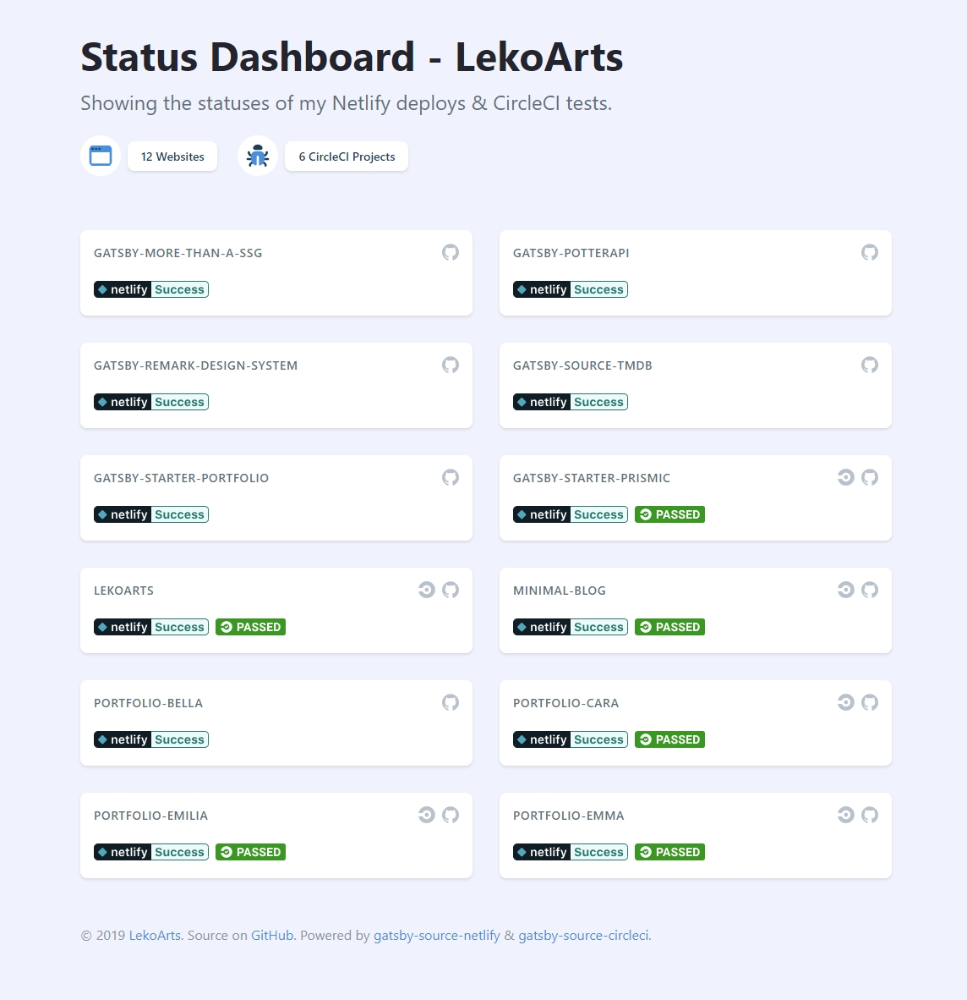

# gatsby-status-dashboard

**Showing the statuses of my Netlify deploys & CircleCI tests.**

Made with [gatsby-source-netlify](https://github.com/LekoArts/gatsby-source-netlify) and [gatsby-source-circleci](https://github.com/LekoArts/gatsby-source-circleci).

## Preview

